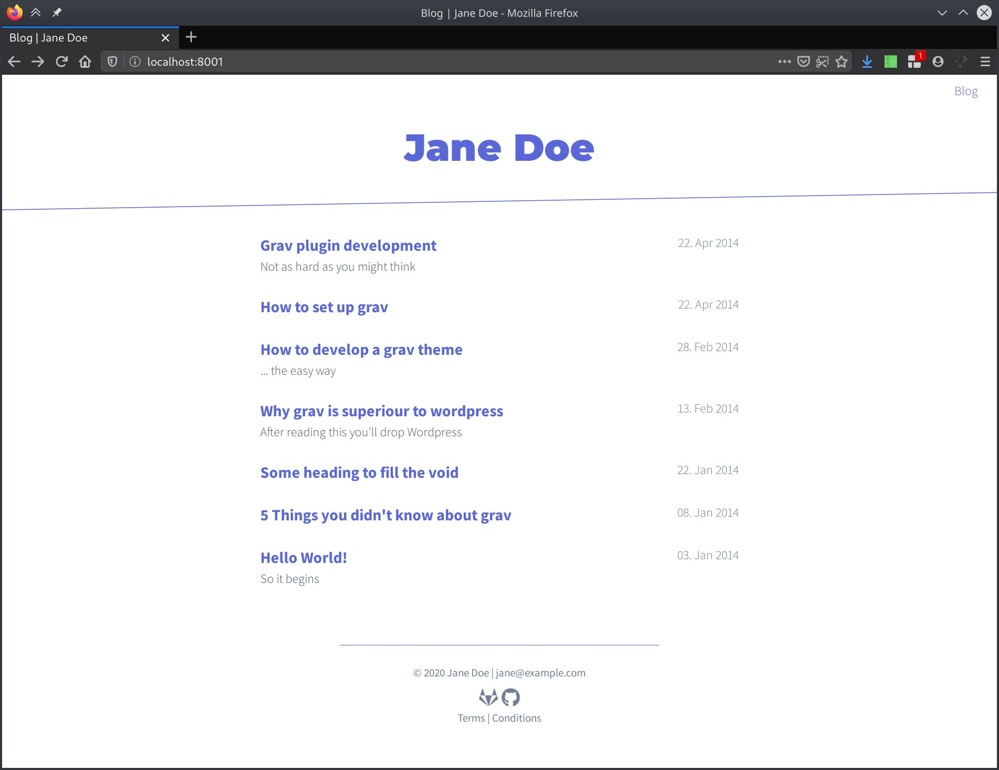

# Tail Theme for Grav

Inspired by grav theme [cacti](https://github.com/getgrav/grav-theme-cacti) and [julian.com](https://www.julian.com)

## Features

* Lightweight and minimal for optimal performance
* Made with [tailwindcss](https://tailwindcss.com/)
* Fully responsive
* Multiple page template types

## Supported Page Templates

* Default view template `default.md`
* Error view template `error.md`
* Blog view template `post-list.md`
* Blog item view template `post.md`

There are templates for books. Books are currently a work in progress:
* Book view template `book-list.md`
* Book item view template `book.md`

# Installation

Installing the Tail theme can be done in one of two ways. Our GPM (Grav Package Manager) installation method enables you to quickly and easily install the theme with a simple terminal command, while the manual method enables you to do so via a zip file. 

The theme by itself is useful, but you may have an easier time getting up and running by installing a skeleton. The Tail theme can be found in both the [One-page](https://github.com/getgrav/grav-skeleton-onepage-site) and [Blog Site](https://github.com/getgrav/grav-skeleton-blog-site) which are self-contained repositories for a complete sites which include: sample content, configuration, theme, and plugins.

## GPM Installation (Preferred)

The simplest way to install this theme is via the [Grav Package Manager (GPM)](http://learn.getgrav.org/advanced/grav-gpm) through your system's Terminal (also called the command line).  From the root of your Grav install type:

    bin/gpm install tail

This will install the Tail theme into your `/user/themes` directory within Grav. Its files can be found under `/your/site/grav/user/themes/tail`.

## Manual Installation

To install this theme, just download the zip version of this repository and unzip it under `/your/site/grav/user/themes`. Then, rename the folder to `tail`. You can find these files either on [GitHub](https://github.com/getgrav/grav-theme-tail) or via [GetGrav.org](http://getgrav.org/downloads/themes).

You should now have all the theme files under

    /your/site/grav/user/themes/tail

# Customizing
Most of the style can be customized by adapting the `class` attributes in the templates. This is the idea of tailwindcss's [Utility-First Approach](https://tailwindcss.com/docs/utility-first).

**Important**: The final css file is cleaned up with `postcss-purgecss` and minified by `postcss-clean`. Meaning: `postcss-purgecss` looks through your twig template files, recognizes which classes you used and then deletes all unused CSS from the final stylesheet. Then the sylesheet is minified using `postcss-clean`.

In case you're trying to add classes to the templates and nothing changes, it is possible that these classes aren't used anywhere else and therefore not present in the cleaned `main.css`. See [Workflow](#workflow) on how to generate the stylesheet.

## Workflow 
- Change to the `themes/tail` directory
- Install the dependencies: `npm install`
- Generate the stylesheet:
  - For development: `npm run compile`
  - For production: `NODE_ENV=production npm run compile`

In the development mode, `main.css` is not cleaned up. All of tailwinds classes can be used. In production mode, `main.css` is cleaned and minified.

If you want to adapt how tailwind is generated, have a look at `tailwind.config.js`. If you want to adapt how postcss works, look at `postcss.config.js`. 
